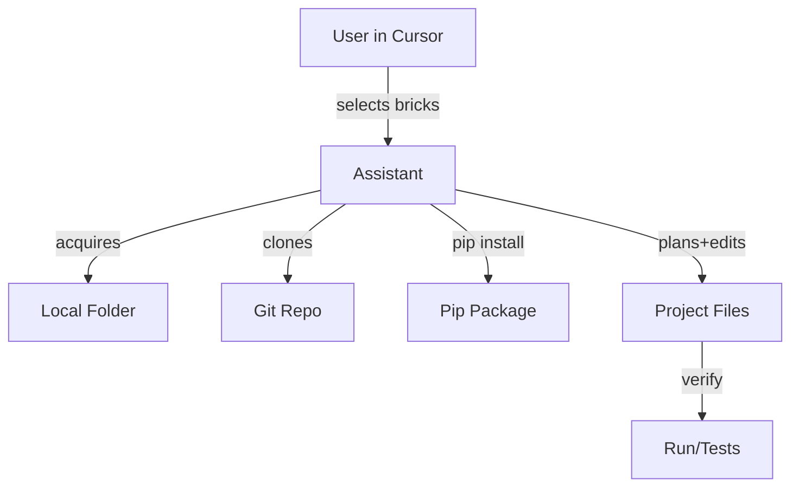
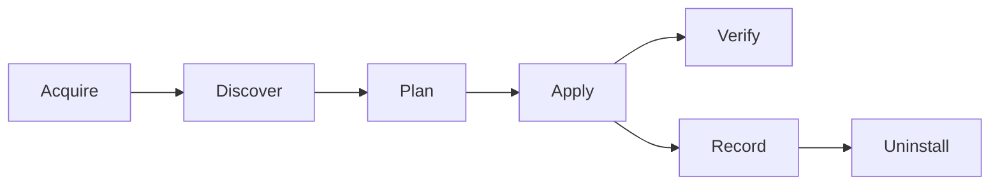

# Django Lego Plate — Architecture

Author: Senior Software Architect

## 1. Overview
The Django Lego Plate assembles Django backends by snapping modular, reusable apps ("bricks") into a minimal base project (the "plate"). Its core competency is safe, idempotent integration across project files rather than code generation.

## 2. Goals and Non-Functional Requirements
- Fast setup for ship while remaining production-aware.
- Idempotent, reversible edits (support uninstall/rollback).
- Minimal diffs; dry-run planning before applying changes.
- Clear verification steps (install, migrate, run, tests).
- Extensible brick ecosystem (local folders, git repos, pip packages).
- Security hygiene: secrets via env, no plaintext credentials.
- Observability-ready: optional Sentry integration.

## 3. System Context
- User/Developer operates in Cursor with GPT-5.
- Sources: local folders, git repos, pip packages.
- Target: a Django project on the local filesystem.



- Cursor-native developer experience:
  - Drag-and-drop a brick folder into the repo → Assistant discovers brick and shows a dry-run plan with inline diffs.
  - One-click "Apply" executes non-interactive commands (install, migrate, collectstatic) and surfaces results inline.
  - Idempotent re-apply is safe; uninstall/rollback supported via recorded ledger.

## 4. Logical Architecture
Modules:
1) Baseplate Manager
   - Ensures a minimal Django project exists (creates if missing).
2) Brick Source Manager
   - Acquires bricks from local path, git URL, or pip package.
3) Brick Discovery
   - Manifest-first (`brick.yaml/json`); heuristic fallback (scan for `apps.py`, `urls.py`, deps, settings).
4) Integration Planner
   - Builds a dry-run plan: requirements, settings, urls, env, middleware, migrations, Celery, admin, templates/static.
5) File Mutation Engine
   - Applies idempotent edits with minimal diffs; creates missing files.
6) Verification Runner
   - Produces non-interactive commands and health checks.
7) Change Recorder
   - Writes `lego_manifest.json` for uninstall/rollback.



## 5. Brick Manifest (v1)
Format: YAML or JSON

```yaml
name: my-brick
version: 1.0.0
dependencies:
  - djangorestframework>=3.15
django:
  installed_apps: ["rest_framework"]
  middleware: []
  settings:
    REST_FRAMEWORK:
      DEFAULT_AUTHENTICATION_CLASSES:
        - rest_framework.authentication.SessionAuthentication
      DEFAULT_PERMISSION_CLASSES:
        - rest_framework.permissions.AllowAny
  urls:
    - include: rest_framework.urls
      mount: "/api/"
  templates: []
  static: []
  migrations: true
  admin: true
  signals:
    module: my_brick.signals
  celery:
    enabled: false
    tasks_module: my_brick.tasks
    beat_schedules: {}
env:
  - key: DEBUG
    required: false
    default: true
drf:
  enabled: true
  routers:
    - module: my_brick.api.urls
      base_path: "/api/my-brick/"
permissions:
  - name: my_brick.view_item
  - name: my_brick.add_item
post_install:
  - command: python manage.py migrate
uninstall:
  remove_requirements: true
  remove_env_keys: ["MY_BRICK_API_KEY"]
  remove_settings_keys: ["REST_FRAMEWORK.DEFAULT_PERMISSION_CLASSES"]
```

Validation: A lightweight JSON Schema can be used to validate manifests.

## 6. Integration Plan (dry-run)
Plan items are ordered and idempotent:
- Requirements: add packages with versions.
- Settings: add to `INSTALLED_APPS`, `MIDDLEWARE`, insert or merge settings blocks.
- URLs: include routes under a namespaced mount path.
- Env: append to `.env.example`, read via `os.environ`.
- Files: create `celery.py`, `pytest.ini`, Docker files as required.
- Migrations: ensure apps are discoverable; run migrations.
 - OpenAPI: mount DRF Spectacular schema at `/api/schema/` and docs at `/api/docs/` (if Spectacular brick enabled).
 - Static: configure WhiteNoise if enabled (middleware ordering and storage backend).

Conflict handling:
- Namespacing: prefer `api/<brick>`; fail-safe if collisions detected.
- Deduplication: avoid duplicate entries in lists/blocks.
 - Middleware ordering rules: place `corsheaders.middleware.CorsMiddleware` early; place `whitenoise.middleware.WhiteNoiseMiddleware` right after `SecurityMiddleware`.

## 7. File Mutation Engine
Guidelines:
- Minimal diffs; preserve formatting as much as possible.
- Idempotent operations: safe to re-run.
- Create missing files/directories.
- Record every change (file, action, snippet) to a ledger `tools/lego_manifest.json` (per-apply entries keyed by brick and timestamp).
- List operations perform set-like merges (no duplicates) and respect stable insertion anchors (e.g., insert CORS before Django’s `CommonMiddleware`).
- URL includes are namespaced and guarded with existence checks to prevent duplicate `include(...)` lines.

## 8. Uninstall and Rollback
- Read `lego_manifest.json` to reverse edits (requirements, settings, URLs, env entries, created files when safe).
- Database migration rollback is optional and user-driven.
- Validate project runs after uninstall.
- If a brick defines explicit `uninstall` directives in its manifest, prefer those (e.g., remove specific env/settings keys) while leaving unrelated user edits intact.

## 9. Configuration and Environments
- Use `.env` and `.env.example`; never commit secrets.
- Recommended keys: `SECRET_KEY`, `DEBUG`, `ALLOWED_HOSTS`, `DATABASE_URL` (or discrete vars), `CELERY_BROKER_URL`, `SENTRY_DSN`.
 - For non-local brokers/databases, allow overrides via a single `DATABASE_URL`/`CELERY_BROKER_URL` with sensible defaults for SQLite and Redis.

## 10. Security
- No secrets in source; rely on environment variables.
- Pin critical dependencies; upgrade regularly.
- Sanitize user-provided brick sources (avoid executing arbitrary code during discovery).

## 11. Testing Strategy
- Unit tests for discovery, planning, and mutation utilities.
- Integration tests for end-to-end brick import flows (DRF, CORS, Spectacular).
- Smoke tests after apply: `manage.py check`, `migrate`, runserver ping.
 - Default test tooling via pytest brick: `pytest`, `pytest-django`, `pytest-cov` with a minimal `pytest.ini` and a sample test that asserts `/api/schema/` returns 200 when Spectacular is enabled.
 - CI-friendly non-interactive commands and deterministic environment setup using `.env.example`.

## 12. Observability
- Optional Sentry brick for error monitoring.
- Log integration steps and decisions with concise, user-facing outputs.
 - If Sentry is configured, initialize early in `settings.py` using DSN from environment, and tag environment/release when available.

## 13. Extensibility and Roadmap
- Versioned manifest schema; adapters for popular bricks.
- Rich conflict resolver and interactive diffs.
- Remote curated brick catalog with signatures.
- GUI for brick selection and uninstall.

## 14. Risks and Mitigations
- Brick conflicts → namespacing, detection, and user prompts.
- Incomplete manifests → heuristic fallback and conservative defaults.
- Unsafe edits → dry-run, minimal diffs, and `lego_manifest.json` for revert.

## 15. Operational Playbook (shippingdefault)
1) Ensure baseplate: create minimal Django project if missing.
2) Import selected bricks; apply plan.
3) Install deps, migrate, runserver. Start Celery if applicable.
4) Verify routes and admin, run tests.

## 16. CLI and Cursor Developer Experience
- CLI commands:
  - `python tools/bricks.py plan <path|git|pip>`: produce a dry-run plan with unified diffs.
  - `python tools/bricks.py apply <path|git|pip> --yes`: apply plan non-interactively, install deps, run migrations, record ledger.
  - `python tools/bricks.py remove <app_label> --yes`: uninstall using the ledger; optionally rollback migrations.
  - `python tools/bricks.py list`: list installed bricks and their sources from the ledger.
- Cursor UX:
  - Drag-and-drop a brick folder → automatic plan preview.
  - One-click apply → commands run with outputs shown inline.
  - Safe re-apply and uninstall backed by the ledger.

## 17. Auto-Discovery (No Manifest)
- Heuristics when `brick.yaml/json` is missing:
  - Detect Django app via `apps.py` and `AppConfig`.
  - Include `urls.py` under `api/<app_label>/` by default.
  - Parse `requirements.txt` or `pyproject.toml` for dependencies.
  - Detect `admin.py`, `migrations/`, `templates/`, `static/`, `signals.py`, `middleware.py`, `tasks.py`, `api/urls.py`.
  - Infer environment keys from common patterns and add to `.env.example` with placeholder values.

## 18. Plan and Ledger Formats (Schemas)
- Plan (conceptual):
  - requirements: [{ name, specifier }]
  - settings:
    - installed_apps: [str]
    - middleware: [str]
    - blocks: [{ key_path, merge_strategy, value }]
  - urls: [{ mount, include }]
  - env: [{ key, default, required }]
  - files: [{ path, ensure_exists, content_if_missing }]
  - commands: [str]
- Ledger (`tools/lego_manifest.json`):
  - entries: [{ brick, source, timestamp, actions: [{ file, type, details }] }]


